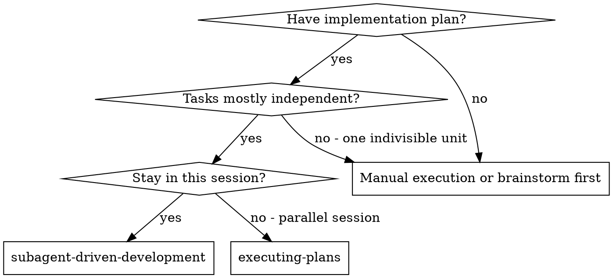
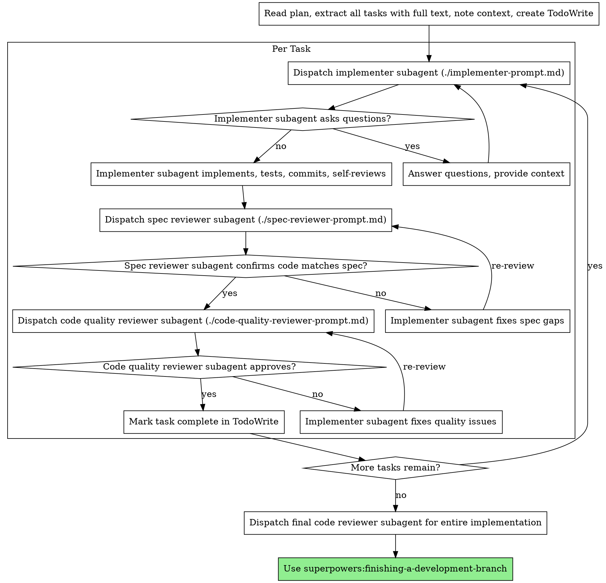

# Subagent-Driven Development

Execute plan → fresh subagent per task. Two-stage review each: spec compliance first, then code quality.

**Why subagents:** Delegate to agents w/ isolated context. Craft their instructions + context precisely → they stay focused + succeed. They never inherit your session history — you build exactly what they need. Also preserves your context for coordination.

**Core principle:** Fresh subagent per task + two-stage review (spec→quality) = high quality, fast iteration.

**Continuous execution:** Don't pause to check in between tasks. Run all tasks, no stopping. Stop only on: unresolvable BLOCKED, progress-blocking ambiguity, or all-done. "Should I continue?" prompts waste partner's time — they said execute, so execute.

## Execution Modes

Two modes. Pick by **file overlap between tasks**:

| Mode | When | Flow |
|---|---|---|
| **Sequential** (default, coupled) | tasks share files/state or have ordering deps | one implementer at a time → spec review → quality review → commit → next |
| **Parallel** (independent) | tasks can run concurrently (disjoint files, or overlap isolated per worktree) | dispatch all implementers at once → review whole batch → integrate → commit · start gate relaxed, acceptance gate kept |

**Decider = "do two tasks write the same file," NOT "are tasks logically independent."** Disjoint writes → agents never collide. Overlap is still parallelizable, but only with per-task isolation (below).

**Two ways to isolate parallel work:**
- **Submode A — disjoint-write (default, simplest):** all implementers share ONE working dir, each owns a disjoint file set, none run git. Controller commits after review. No merge step. **DATA-LOSS risk:** two agents writing the same file here = *silent lost writes* (last writer wins) — use only when files are truly disjoint.
- **Submode B — worktree-per-task (handles overlap):** each implementer gets its own worktree/branch (`isolation: "worktree"`) and commits to it; an integration/merge agent reconciles at the integration gate. Overlap → a resolvable conflict, not lost writes. Caveat: branch-handoff is **unverified in this harness**, and a merge agent on heavy same-function overlap is a bug vector — keep overlaps light.

**Pick submode:**
- disjoint files → A
- unavoidable overlap → B (or pull the overlapping task into a sequential chain)
- deep ordering deps (task N needs task N-1's output) → sequential

## Non-Blocking Dispatch Principle

Implementation tasks should not wait for a previous task's review unless there's a true ordering dependency.

Reviews are required before accepting, merging, or committing final work — NOT before starting unrelated or parallelizable implementation work.

Default: launch all eligible implementers first, then run spec/quality reviews once results are available. Especially apt when implementers are highly capable models (Opus).

## Start Gate vs Acceptance Gate

Don't confuse "task is allowed to start" with "task is accepted."

- **Start gate:** task has enough context + an isolated workspace / file boundary.
- **Acceptance gate:** task passes spec review, quality review, integration review, and real verification.

Parallel mode relaxes the **start gate**, not the **acceptance gate**.

## When to Use



**Coupled-but-delegable tasks → stay in skill, Sequential mode.** Leave the skill only if the work is one indivisible unit w/ nothing to delegate. Graph = delegate-or-not; Execution Modes = sequential-vs-parallel.

**vs. Executing Plans (parallel session):**
- Same session (no context switch)
- Fresh subagent per task (no context pollution)
- Two-stage review per task: spec first, then quality
- Faster iteration (no human-in-loop between tasks)

## The Process

### Sequential Flow (default — coupled tasks)



### Parallel Flow (independent tasks)

Non-blocking: dispatch every eligible implementer at once, then gate on review at acceptance / merge / commit — never at task start (see [Non-Blocking Dispatch Principle](#non-blocking-dispatch-principle)). **Every agent in a parallel run is Opus** — implementers, both reviewers, the integration/merge agent, and the final reviewer (see [Model Selection](#model-selection)). Where each gate sits:

```
plan parsed
→ dispatch all eligible implementers in parallel    [START GATE: context + file boundary / worktree]
→ collect results
→ review each result (spec → quality)               [ACCEPTANCE GATE, per task]
→ fix only the failed ones
→ integration/merge agent resolves overlaps         [INTEGRATION GATE — submode B only]
→ final review + full test/type/build verification  [ACCEPTANCE GATE, whole]
→ controller commits / finish                       [RELEASE GATE]
```

Steps:

1. **Read plan once.** Extract all tasks: full text + context. Make task list.
2. **Map file ownership + pick submode** (see [Execution Modes](#execution-modes)). Per task → list every file it creates/edits. Disjoint → **submode A**. Unavoidable overlap → **submode B**. Deep ordering dep → pull to a sequential chain.
3. **Dispatch the whole batch in ONE message** (concurrent). Each implementer:
   - `model: opus` (parallel default = most capable, see [Model Selection](#model-selection))
   - full task text + scene-setting context
   - explicit **file-ownership boundary**: "You own ONLY these files: [...]."
   - submode A → **no git / no commit** (controller commits). submode B → `isolation: "worktree"`, commit to your own branch.
4. **Collect every report before reviewing** — the acceptance gate doesn't open until results exist. Note status (DONE / DONE_WITH_CONCERNS / BLOCKED / NEEDS_CONTEXT), handle blockers per [Handling Implementer Status](#handling-implementer-status).
5. **Review each result — spec THEN quality.** Fan reviewers out in parallel (1 spec + 1 quality per task), each on `model: opus`. A failing review blocks only THAT task's acceptance, not the others.
6. **Fix only the failed ones.** Re-dispatch a fix subagent (`model: opus`) scoped to that task. Re-review til clean.
7. **[Submode B] Integration/merge agent** (`model: opus`) reconciles branches at the integration gate. Keep overlaps light — a merger reconstructing intent on heavy same-function conflicts is a bug vector. (Submode A has nothing to merge.)
8. **Final integration review** (`model: opus`) **+ full verification** over the whole. Run the full test / type / build pass HERE — agents only saw their slice; cross-task interaction bugs surface only now.
9. **Commit / finish.** Controller commits (submode A: one commit per task; submode B: after merge). Hand off → **superpowers:finishing-a-development-branch**.

**Why this is safe:** parallel mode relaxes only the START gate (see [Start Gate vs Acceptance Gate](#start-gate-vs-acceptance-gate)) — every task still passes spec, quality, integration, and real verification before it's accepted or committed. You trade serial *waiting*, not quality.

**Submode B caveat:** recovering each agent's worktree branch to merge it back is **not a verified path in this harness**. Prefer submode A when you can partition cleanly; reach for B only when overlap is unavoidable, and confirm the branch handoff end-to-end.

## Model Selection

Use the least powerful model that handles each role → save cost, gain speed.

- **Mechanical** (isolated fns, clear spec, 1-2 files) → cheap, fast model. Most impl tasks are mechanical when the plan is well-specified.
- **Integration / judgment** (multi-file coordination, pattern-match, debug) → standard model.
- **Architecture / design / review** → most capable.

Signals:
- 1-2 files + complete spec → cheap
- multi-file + integration concerns → standard
- design judgment / broad codebase understanding → most capable

**Parallel-mode default → Opus for EVERY agent.** Not just implementers — the spec reviewer, quality reviewer, integration/merge agent, and final reviewer all run on Opus too. Cheap-model guidance optimizes a *serial* pipeline (cost compounds task-after-task); a parallel batch has no serialization to amortize → capability-per-task dominates, stronger agents land clean w/ less rework. Reserve cheaper models for clearly-mechanical tasks in a sequential run.

## Handling Implementer Status

Implementers report one of four. Handle each:

**DONE:** → spec compliance review.

**DONE_WITH_CONCERNS:** completed but flagged doubts. Read concerns first. Correctness/scope → address before review. Observations (e.g. "file getting large") → note + proceed.

**NEEDS_CONTEXT:** missing info. Provide + re-dispatch. (Parallel: includes hitting a file outside its ownership set → re-partition or move task to the sequential chain.)

**BLOCKED:** can't complete. Assess:
1. context problem → more context, re-dispatch same model
2. needs more reasoning → re-dispatch more capable model
3. too large → split smaller
4. plan itself wrong → escalate to human

**Never** ignore an escalation or force the same model to retry unchanged. Stuck → something must change.

## Prompt Templates

- `./implementer-prompt.md` - Dispatch implementer subagent
- `./spec-reviewer-prompt.md` - Dispatch spec compliance reviewer subagent
- `./code-quality-reviewer-prompt.md` - Dispatch code quality reviewer subagent

## Example Workflow (Sequential)

```
You: I'm using Subagent-Driven Development to execute this plan.

[Read plan file once: docs/superpowers/plans/feature-plan.md]
[Extract all 5 tasks with full text and context]
[Create TodoWrite with all tasks]

Task 1: Hook installation script
[Dispatch implementation subagent with full task text + context]

Implementer: "Before I begin - hook installed at user or system level?"
You: "User level (~/.config/superpowers/hooks/)"
Implementer:
  - Implemented install-hook command
  - Added tests, 5/5 passing
  - Self-review: missed --force flag, added it
  - Committed

[Spec reviewer] ✅ Spec compliant - all met, nothing extra
[Code quality reviewer] Strengths: good coverage, clean. Issues: none. Approved.
[Mark Task 1 complete]

Task 2: Recovery modes
Implementer: [no questions] added verify/repair, 8/8 passing, committed

[Spec reviewer] ❌ Missing: progress reporting ("report every 100 items"); Extra: --json flag (not requested)
[Implementer] removed --json, added progress reporting
[Spec reviewer] ✅ compliant now
[Code quality reviewer] Issues (Important): magic number (100)
[Implementer] extracted PROGRESS_INTERVAL constant
[Code quality reviewer] ✅ Approved
[Mark Task 2 complete]

...
[Final code-reviewer] All met, ready to merge
Done!
```

## Example Workflow (Parallel)

```
You: Executing this 3-task plan in parallel. File-ownership map:
  Task 1 → src/parser.ts, src/parser.test.ts
  Task 2 → src/formatter.ts, src/formatter.test.ts
  Task 3 → docs/api.md
No shared files → valid parallel batch.

[Dispatch all 3 in ONE message: model: opus, file-ownership boundary each, WRITE-ONLY (no git)]

Implementer 1: DONE — parser written, 6/6 unit tests pass (did not commit)
Implementer 2: DONE — formatter written, 4/4 pass (did not commit)
Implementer 3: DONE — api.md written

[All reported. Review whole batch — fan out spec + quality reviewers per task]
Spec:    T1 ✅  T2 ✅  T3 ❌ (missing "Errors" section the task asked for)
Quality: T1 ✅  T2 ⚠ magic number  T3 —

[Fix loop, scoped per task]
  Fix agent T2 → extract constant
  Fix agent T3 → add Errors section
[Re-review: T2 ✅  T3 ✅]

[Controller commits — one per task, staging only that task's files]
  git add src/parser.*    && git commit -m "feat: add parser"
  git add src/formatter.* && git commit -m "feat: add formatter"
  git add docs/api.md     && git commit -m "docs: add api reference"

[Final integration review + full test/type/build pass] ✅
Done!
```

## Advantages

**vs. Manual execution:**
- Subagents follow TDD naturally
- Fresh context per task (no confusion)
- Context-isolated per task (each gets only what it needs — no cross-task pollution)
- Subagent can ask questions (before AND during work)

**vs. Executing Plans:**
- Same session (no handoff)
- Continuous progress (no waiting)
- Review checkpoints automatic

**Efficiency:**
- No file-read overhead (controller provides full text)
- Controller curates exactly the needed context
- Subagent gets complete info upfront
- Questions surface before work begins
- Parallel mode collapses N serial task-cycles into one batch when tasks are independent

**Quality gates:**
- Self-review catches issues before handoff
- Two-stage review: spec, then quality
- Review loops ensure fixes actually work
- Spec compliance prevents over/under-building
- Code quality ensures it's well-built

**Cost:**
- More subagent invocations (implementer + 2 reviewers/task)
- Controller does more prep (extract all tasks upfront; map file ownership in parallel mode)
- Review loops add iterations
- But catches issues early (cheaper than debugging later)

## Red Flags

**Never:**
- Start implementation on main/master without explicit user consent
- Skip reviews (spec OR quality)
- Proceed with unfixed issues
- Put two tasks that share a file in one parallel batch (→ silent lost writes) — parallel is safe ONLY when every task writes a strictly disjoint file set AND implementers don't run git (see [Parallel Flow](#parallel-flow-independent-tasks))
- Make subagent read the plan file (provide full text instead)
- Skip scene-setting context (subagent must know where the task fits)
- Ignore subagent questions (answer before they proceed)
- Accept "close enough" on spec compliance (issues found = not done)
- Skip review loops (issues → fix → review again)
- Let self-review replace actual review (need both)
- **Start quality review before spec compliance is ✅** (wrong order)
- (Sequential mode) Move to next task while either review has open issues — parallel mode instead STARTS all eligible tasks up front; reviews gate acceptance, not start

**Parallel-mode (additional):**
- Confuse the start gate with the acceptance gate — blocking an independent task's START on another task's review (only a true ordering dependency justifies blocking a start)
- (Submode A) Two tasks writing the same file in one batch → silent lost writes; use submode B (worktrees) or chain them sequentially
- (Submode A) Parallel implementers running git / committing — controller commits once the batch passes (concurrent committers race the index)
- Omit the file-ownership boundary from a parallel implementer's prompt
- Start reviewing a batch before every implementer reported back
- (Submode B) Ship without resolving overlaps at the integration gate, or lean on a merge agent for heavy same-function conflicts
- Skip the final full-suite verification (agents each saw only their slice)

**If subagent asks questions:** answer clearly + completely; add context if needed; don't rush them into impl.

**If reviewer finds issues:** same subagent fixes → reviewer re-reviews → repeat til approved. Don't skip the re-review.

**If subagent fails task:** dispatch fix subagent w/ specific instructions. Don't fix manually (context pollution).

## Integration

**Required workflow skills:**
- **superpowers:using-git-worktrees** - isolated workspace (create or verify)
- **superpowers:writing-plans** - creates the plan this skill executes
- **superpowers:requesting-code-review** - review template for reviewer subagents
- **superpowers:finishing-a-development-branch** - complete dev after all tasks

**Subagents should use:**
- **superpowers:test-driven-development** - TDD per task

**Alternative workflow:**
- **superpowers:executing-plans** - parallel session instead of same-session
