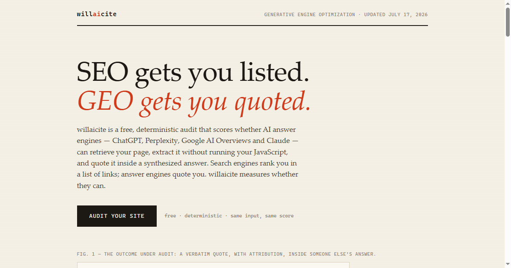

<div align="center">



# willaicite

**A free, deterministic audit that scores whether AI answer engines can retrieve, read, and quote your web page.**

[](https://willaicite.com)
[](LICENSE)
[](package.json)
[](tests)
[](package.json)
[](tsconfig.json)

[Run a live audit](https://willaicite.com/app) &middot; [How it works](https://willaicite.com) &middot; [Crawler registry](https://willaicite.com/crawlers) &middot; [Proof](https://willaicite.com/proof)

</div>

---

Search engines rank you in a list of links. Answer engines quote you inside a synthesized reply. Those are different games, and a page can win the first while losing the second: to be quoted, an answer engine has to fetch your page with its own crawler, read it without executing your JavaScript, and find a passage worth lifting. willaicite scores all three, one verdict per engine, and tells you exactly what to fix.

Point it at a URL and get a 0 to 100 score across eight weighted dimensions, with evidence on every line: the exact robots.txt rule that blocks a bot, the HTTP status a crawler actually receives, the sentence an engine could quote. There are no LLM calls, so the same input always produces the same score.

Try it now at **[willaicite.com/app](https://willaicite.com/app)**, or run it locally.

## What your SEO tool does not test

SEO tooling audits the path to a ranking. willaicite audits the path to a citation. Five places the two roads split:

- **The block robots.txt will not admit to.** willaicite fetches your page twice, once as an ordinary browser and once wearing an AI crawler's user agent, then compares the responses. A CDN firewall rule (Cloudflare's one-click "block AI bots" toggle, for example) can return 403 to the real crawler while robots.txt still says allowed. SEO crawlers never walk the AI-bot path, so they report clean while the engine silently drops your page.
- **The single-page app nobody is reading.** Googlebot and Lighthouse render JavaScript. GPTBot, ClaudeBot, and PerplexityBot do not; they see whatever the server sends and nothing more. A client-rendered page can audit perfectly and still arrive at the answer engine as an empty shell. willaicite scores how much of your content survives in the raw HTML, from the exact no-JavaScript vantage those crawlers have.
- **The outbound-citation inversion.** SEO folklore says external links leak authority, so pages cite no one. The original GEO study (Aggarwal et al., KDD 2024) measured the opposite effect on AI visibility: citing sources lifted it 24.9%, statistics 25.9%, quotations 27.8%. Independent 2025&ndash;2026 replications shrank those effects to a post-retrieval tie-break &mdash; see the research basis below &mdash; but the direction held, and it still means optimizing for the ranking can quietly cost you the quote.
- **A verdict per engine, weighed by what it costs you.** "Is Googlebot allowed" is one question. willaicite asks it for a roster of AI crawler tokens and separates retrieval crawlers, where a block means that engine can never cite you, from training-only tokens, where blocking is a legitimate policy choice.
- **Is there a liftable answer.** Engines quote a chunk verbatim. willaicite checks whether one exists: a self-contained answer near the top, headings phrased as the questions people actually ask, an FAQ ready to be lifted whole. You can rank first for a query and still contain nothing an engine can use.

## The eight dimensions

Every audit scores the same eight dimensions, each weighted by how often it decides whether a citation happens. The overall score is the weighted average of the dimensions that could be verified. The weights follow the 2025&ndash;2026 replication literature, not the 2024 headline numbers: v1.3 added topical focus (high), promoted freshness to high, and demoted evidence density to medium.

| # | Dimension | Weight | What it measures |
|---|---|---|---|
| 01 | **AI crawler access** | high | Can the engines that cite pages fetch this one at all, per crawler token, checking robots.txt and the CDN firewall both |
| 02 | **Renderability** | high | How much content survives in the raw HTML with no JavaScript executed, the way GPTBot and PerplexityBot see it |
| 03 | **Answer-readiness** | high | Whether a self-contained, liftable answer sits near the top under question-shaped headings |
| 04 | **Topical focus &amp; metadata** | high | Whether title, H1, description and body legibly present one topic a retriever can match a query against &mdash; the page-side half of relevance, the top controllable citation driver in the 2026 studies |
| 05 | **Evidence density** | medium | The material engines prefer to quote once a page is retrieved: statistics, quotations, and cited sources |
| 06 | **Structured data** | medium | JSON-LD (Article, FAQPage, Organization, Person) that helps Google AI Overviews and entity trust |
| 07 | **Freshness** | high | Visible and machine-readable dates; a recent timestamp is one of the few content factors that consistently lifted citation odds in controlled 2026 testing |
| 08 | **Entity &amp; E-E-A-T** | medium | A nameable author, organization, and provenance an engine can attribute |

Also checked, informational and unscored: `llms.txt` presence, well-formedness, and consistency with robots.txt.

### Research basis

The scoring model tracks the empirical GEO literature, weighted toward controlled and replicated results:

- [Aggarwal et al., *GEO: Generative Engine Optimization*, KDD 2024](https://arxiv.org/abs/2311.09735) &mdash; the original study: quotations +27.8%, statistics +25.9%, cited sources +24.9% visibility, measured with the source already placed in the generator's context.
- [Vishwakarma et al., *What Gets Cited: Competitive GEO in AI Answer Engines*, SIGIR 2026](https://arxiv.org/abs/2605.25517) &mdash; 252,000 controlled trials across six LLMs: topical relevance and retrieval position dominate first-citation odds; recent dates and concrete facts help moderately; formatting-only edits do almost nothing.
- [Puerto et al., *C-SEO Bench: Does Conversational SEO Work?*, NeurIPS D&amp;B 2025](https://arxiv.org/abs/2506.11097) &mdash; independent replication: only 3 of 54 content-rewrite method&ndash;domain combinations significantly positive, which is why evidence density is scored as a post-retrieval tie-break rather than a primary lever.
- [Kumar &amp; Palkhouski, *AI Answer Engine Citation Behavior: The GEO-16 Framework*, 2025](https://arxiv.org/abs/2509.10762) &mdash; field audit of 1,702 real citations on Brave, Google AI Overviews and Perplexity: metadata/freshness, semantic HTML and structured data were the pillars most strongly associated with being cited (correlational).

## Quick start

Requires Node 20 or newer. There are zero runtime dependencies.

```bash
git clone https://github.com/ryanportfolio/willaicite.git
cd willaicite
npm install
npm run build
npm link            # exposes the `geo-audit` command
```

```bash
geo-audit https://example.com               # scored report, printed as markdown
geo-audit https://example.com --json        # machine-readable JSON
geo-audit https://example.com --out report.md
geo-audit serve --port 4173                 # local web UI

# without linking:
node dist/cli.js https://example.com
```

## Web UI

`geo-audit serve` starts a local, zero-dependency web UI. Nothing leaves your machine except the fetches to the site being audited. Enter a URL and watch the real fetch progress stream in over Server-Sent Events (every progress line is an actual request, never cosmetic), then read the full report: overall score, per-dimension bars with expandable evidence, the prioritized fix-first list, and one-click downloads of `report.md` and `result.json`. It is the same audit engine as the CLI, so identical input produces an identical score in both.

The hosted version at [willaicite.com/app](https://willaicite.com/app) is this exact UI.

## Running it as a public service

The CLI is single-user and trusts you. `geo-audit serve` is safe to expose publicly only because the hosted path fetches through an SSRF-guarded transport ([`src/safeFetch.ts`](src/safeFetch.ts)):

- Only `http` and `https`, only ports 80 and 443.
- The destination hostname is resolved and every returned address is checked. Anything loopback, private (RFC 1918), link-local (including the `169.254.169.254` cloud metadata address), CGNAT, or reserved is refused. IPv4-mapped, 6to4, and NAT64 IPv6 forms that embed a private v4 are decoded and re-checked.
- The socket is pinned to the validated IP, so a hostname that re-resolves to a private address between the check and the connection (DNS rebinding) cannot slip through. Redirects are followed manually and every hop is re-validated.
- Per-IP rate limit (default 10 audits per 10 minutes) and a global concurrency cap (default 4).

| Var | Purpose | Default |
|---|---|---|
| `PORT` | Listen port | 4173 |
| `WILLAICITE_TRUST_PROXY` | Set `1` behind a proxy you control, to read `X-Forwarded-For` | off |
| `WILLAICITE_MAX_CONCURRENT` | Max simultaneous audits | 4 |

`--local` disables the SSRF guard so you can audit `localhost` and private targets from the CLI. **Never pass `--local` on a public server.** See [SECURITY.md](SECURITY.md).

## Sample report

<details>
<summary>willaicite audited with willaicite (97/100 under the v1.3 model, abridged)</summary>

```
# GEO Audit: https://willaicite.com

## Overall score: 97/100

**Excellent: well positioned to be retrieved and cited by AI answer engines.**

| Dimension | Weight | Score |
|---|---|---|
| AI crawler access | high | 100/100 |
| Renderability | high | 100/100 |
| Structured data | medium | 100/100 |
| Answer-readiness | high | 100/100 |
| Topical focus & metadata | high | 81/100 |
| Evidence density | medium | 100/100 |
| Freshness | high | 100/100 |
| Entity & E-E-A-T | medium | 100/100 |

## Dimension detail

### AI crawler access: 100/100 (weight: high)

- 11 retrieval/citation crawler(s) allowed: OAI-SearchBot, ChatGPT-User,
  Claude-SearchBot, Claude-User, PerplexityBot, Perplexity-User, Bingbot,
  Amazonbot, DuckAssistBot, Applebot, MistralAI-User
- 6 training crawler(s)/opt-out token(s) allowed: GPTBot, ClaudeBot, CCBot,
  meta-externalagent, Google-Extended, Applebot-Extended
- UA differential: normal UA and GPTBot UA both got HTTP 200; no WAF-level
  bot blocking detected
```

The full run, including the baseline-to-100 history (scored under the v1.2 model), is on the [proof page](https://willaicite.com/proof). The v1.3 recalibration is stricter: the same site scores 97, with the new topical-focus dimension flagging the slogan H1 and an overlong meta description &mdash; findings we agree with and will fix.

</details>

## Development

```bash
npm test            # Vitest suite over fixture HTML and robots.txt files (152 tests)
npm run dev <url>   # run from source via tsx
```

## Limitations, stated honestly

- **No JavaScript rendering.** Renderability is a heuristic on raw HTML (shell detection, text volume and ratio). Pages that hydrate real server-rendered HTML are judged fairly; lazy-loaded sections are undercounted. There is no headless browser in v1.
- **Heuristic answer-readiness.** "Direct answer" detection is lexical (a subject plus is/are/means/helps near the top), not semantic. A well-written page can fail the pattern and the reverse can happen too.
- **No live AI-engine querying.** This measures retrieval and citation readiness, not whether engines actually cite you today.
- **Robots matching** implements the practically relevant parts of RFC 9309 (longest-match, allow-wins-ties, `*` and `$` wildcards, percent-encoding normalization for non-ASCII paths). Exotic corner cases may still differ from Google's reference matcher.
- **The evidence-density numbers** come from the original GEO study (Aggarwal et al., KDD 2024), measured with the source already placed in the model's context. Later work (C-SEO Bench, NeurIPS D&amp;B 2025; the 252,000-trial SIGIR 2026 study) finds the effects are smaller and conditional: topical relevance and retrieval position dominate, and evidence-rich content mainly wins the tie-breaks after a page is already retrieved. The v1.3 weights reflect that; treat the numbers as directional, not gospel.
- **Topical focus is a lexical proxy.** With no target query, the audit measures whether the page states one coherent topic (title/H1/description/body agreement), not relevance to any actual query &mdash; and retrieval position, the other dominant factor in the 2026 studies, is not page-controllable and is not scored.
- **Scores are comparable only within one scoring-model version** (the `version` field in the JSON output). Heuristic recalibrations bump the version, so do not compare a v1.3 score against a v1.2 score.

## Roadmap: v2

Live share-of-voice probing: query multiple AI engines (ChatGPT, Perplexity, Claude, AI Overviews) with a tracked prompt list, several samples per prompt (single-sample checks measure randomness, not visibility), and report brand mentions against competitors over time. This needs live engine access and gives non-deterministic results, which is why it stays out of scope for the deterministic v1.

## License

MIT. See [LICENSE](LICENSE).

<div align="center">

Made by Ryan &middot; [willaicite.com](https://willaicite.com) &middot; [hello@willaicite.com](mailto:hello@willaicite.com)

</div>
